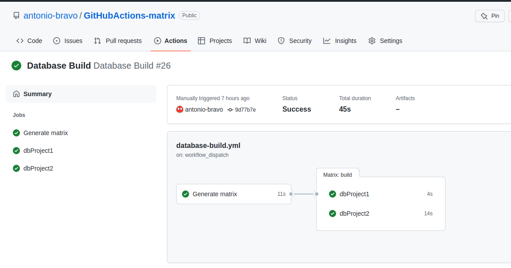

# GitHubActions-matrix

This project is used to create a **dynamic matrix for GitHub Actions** in order to create multiple jobs based on parameter values passed by workflow_dispatch.

## Components

1. Powershell script [create-matrix.ps1](https://github.com/antonio-bravo/GitHubActions-matrix/blob/main/.github/workflows/create-matrix.ps1) on .github/workflows/create-matrix.ps1
2. Workflow [database-build.yml](https://github.com/antonio-bravo/GitHubActions-matrix/blob/main/.github/workflows/database-build.yml) on .github/workflows/database-build.yml

### **1. create-matrix.ps1**
``` powershell
param(
  [String]$element = "db",
  [String[]]$array
)

# $element = "db"
# [String[]]$array = ('db1', 'db2')
$elements = @()
$countarray = $array.Count

@($array) | ForEach-Object {
    $elements += @{
        $element = $_
    }
}

# Output the result for consumption by GH Actions
#Write-Host "::set-output name=matrix::$($($elements | ConvertTo-JSON -Compress) -replace '([\\]*)"', '$1$1\"'))"
if ($countarray = 1) {
  #add [] when there is only one element in the array
  return "[$($elements | ConvertTo-JSON -Compress )]"
}
else {
  return $($elements | ConvertTo-JSON -Compress)
}
```

### **2. database-build.yml**
``` yaml
name: Database Build

on:
  # push:
  #   branches: [ "main" ]
  # pull_request:
  #   branches: [ "main" ]
  workflow_dispatch:
    inputs:
      db-projectname:
        description: Database [dbProject1, dbProject2]
        required: true


concurrency:
  group: ${{ github.ref }}
  cancel-in-progress: true

jobs:
  matrix:
    name: Generate matrix
    runs-on: ubuntu-latest
    outputs:
      matrix-json: ${{ steps.set-matrix.outputs.matrix }}
    steps:
      - uses: actions/checkout@v2
      - id: set-matrix
        shell: pwsh
        #use a small powershell script to generaet the matrix
        #echo '::set-output name=matrix::[{"db":"db1"}]'
        run: |
            $output=.github/workflows/create-matrix.ps1 -array ${{ inputs.db-projectname }}
            #Remove additional [] at begining and end
            if ($output.Substring(0,2) -eq "[[") 
            {
              $output = $output.Substring( 1, $output.Length -1)
            }
            
            echo "matrix=$output" | Out-File -FilePath $Env:GITHUB_OUTPUT -Encoding utf8 -Append
          
          # The `set-output` command is deprecated and will be disabled soon. Please upgrade to using Environment Files. For more information see: https://github.blog/changelog/2022-10-11-github-actions-deprecating-save-state-and-set-output-commands/
          # Write-Host "::set-output name=matrix::$output"
      - name: see json
        shell: pwsh
        run: |
             Write-Host "output=${{steps.set-matrix.outputs.matrix}}"
  build:
    needs: [matrix]

    strategy:
      fail-fast: false
      matrix: 
        include: ${{ fromJson(needs.matrix.outputs.matrix-json) }}
    
    name: "${{ matrix.db }}"
    runs-on: ubuntu-latest 

    steps:
      - uses: actions/checkout@v2
      - name: ${{ matrix.db }}
        shell: pwsh
        run: |
            Write-Host "${{ matrix.db }}"
```

### **Errors got**
```
Database Build: .github#L1
Error when evaluating 'strategy' for job 'build'. .github/workflows/database-build.yml (Line: 41, Col: 15): 
Error parsing fromJson,.github/workflows/database-build.yml (Line: 41, Col: 15): 
Error reading JToken from JsonReader. Path '', line 0, position 0.,
.github/workflows/database-build.yml (Line: 41, Col: 15): 
Unexpected type of value '', expected type: Mapping.
```


### **When it was successfully run and generated :D**

